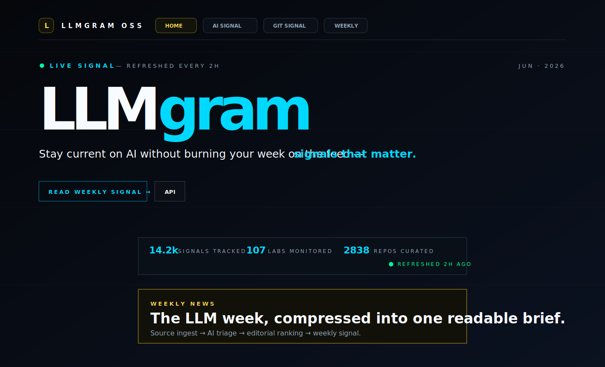

# LLMgram OSS

Open-source demo of **LLMgram**: an AI signal intelligence stack that turns noisy public AI streams into ranked signals, weekly briefs and API-ready datasets.

This repository is a clean public extraction. It ships with **sample data only** and no production history, credentials, private datasets, FTP deployment material, analytics secrets, DM/X credentials or internal automation state.

## Preview



## Architecture


Read:

- [`docs/ARCHITECTURE.md`](docs/ARCHITECTURE.md) — source ingest → AI triage → editorial ranking → publishing.
- [`docs/PRODUCTION_BLUEPRINT.md`](docs/PRODUCTION_BLUEPRINT.md) — production deployment with DB, queues, agents, provenance and review loops.
- [`docs/REPORT.md`](docs/REPORT.md) — visual/report snapshot.
- [`openapi.yaml`](openapi.yaml) — demo API contract.

## What is included

- Flask demo app.
- Dark LLMgram-style UI.
- Synthetic sample signals, sources and weekly digest.
- OpenAPI contract.
- Architecture/production blueprint docs.
- GitHub Actions with pytest + gitleaks.

## What is not included

- Production llmgram.app history.
- Real feed datasets.
- X/Twitter credentials, DM state or bot scripts.
- FTP/deployment credentials.
- Analytics tunnel/secrets.
- Private newsletters, subscriber DBs, agent sessions or logs.

## Quickstart

```bash
python3 -m venv .venv
source .venv/bin/activate
pip install -r requirements.txt
python app.py
```

Open: <http://127.0.0.1:5000>

## API

```text
GET /api/signals?limit=20&offset=0&q=&category=
GET /api/weekly
GET /api/sources
GET /api/stats
```

Example signal:

```json
{
  "id": "sig-open-weights-agent-runtime",
  "rank": 4,
  "title": "Open-weight models become more useful when wrapped in an agent runtime",
  "category": "architecture",
  "score": 87,
  "confidence": 82,
  "tags": ["open-weights", "runtime", "tools", "memory"]
}
```

## Safety checks

```bash
python -m compileall app.py
pytest -q
```

CI also runs gitleaks on push/PR.

## License

MIT. See [`LICENSE`](LICENSE).
