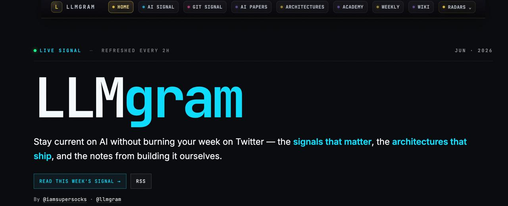

# LLMgram OSS Report

## Status

LLMgram OSS is a clean public demo repo for the llmgram.app concept. It presents the product as an AI signal intelligence stack rather than a one-off static site.

## Visual target

### Product preview



### Architecture


## Public repo contents

- Flask demo backend.
- LLMgram-style homepage.
- Synthetic signals/sources/weekly sample data.
- OpenAPI contract.
- Production blueprint.
- CI with pytest + gitleaks.

## Safety boundary

Included:

- demo UI;
- sample JSON;
- architecture docs;
- tests;
- OpenAPI.

Excluded:

- production Git history;
- `.env` material;
- X/Twitter credentials;
- FTP deployment state;
- analytics secrets;
- subscriber databases;
- private DM/bot state;
- logs and backups.

## Why this can become the real architecture

The core architecture is:

```text
source ingest → queue/dedupe → AI triage → human editorial ranking → publishing/API/KB
```

For a Mistral-facing or enterprise-facing version, the value is not only the website. It is the editorial intelligence runtime:

- model-assisted triage;
- provenance;
- scoring;
- deduplication;
- human review;
- weekly synthesis;
- API/RSS distribution;
- knowledge-base handoff.

## Next upgrades

1. Add a real database adapter behind the OpenAPI contract.
2. Add a queue worker for collectors and triage jobs.
3. Add a golden evaluation set for model triage quality.
4. Add admin/editor review UI.
5. Add RSS generation from approved weekly issues.
